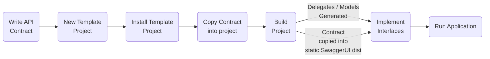
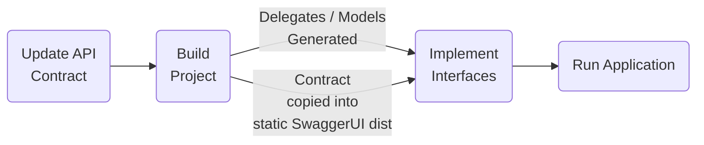

# Contract First API Template

## API Generation
The template project enforces that the API is defined in the OpenAPI specification before any code is implemented and ensures the contract is always up to date. Changing the exposed interface / contract requires updating the ServiceDefinition.yaml file first. At build time, the project reads from the ServiceDefinition.yaml file in the project root then generates request models, response models, interfaces and controller delegates for each endpoint in a single file called ControllerDelegates.cs. This file is not meant to be checked in, any changes in the ServiceDefinition.yaml are dynamically updated at build time.

## Development Process

### New API


### Updating an existing API



## Installing the Template

The template can be used either by the dotnet CLI (dotnet new) or Visual Studio to create an new API project.
### General Info
https://docs.microsoft.com/en-us/dotnet/core/tools/custom-templates


### Installation
From the ContractFirst.Api directory run: the following command:
```
dotnet new --install ./
```
### Removing Template
```
dotnet new --uninstall cf-apils
```
### Create a project using template
```
dotnet new ContractFirst.WebApi
```

## Implementation

Once the ConrollerDelegates.cs file has been generated an implementation class needs to be provided and registered for each Interface. Take the following generated class, note the IPetController interface

```c#

public partial class PetController : Microsoft.AspNetCore.Mvc.ControllerBase
{
     private IPetController _implementation;

     public PetController(IPetController implementation)
     {
         _implementation = implementation;
     }

     // truncated ....

}
```
Add a new class that implements all the methods defined in the IPetController interface.

```c#
public class PetControllerImp : IPetConroller {

    // Implement methods in interface

}

```
Then register the new class in the Program.cs file

```c#
builder.Services.AddScoped<IPetController, PetControllerImp>();
```
## Swagger UI
Included in the API project is a local distrobution of [Swagger UI](https://github.com/swagger-api/swagger-ui) that is served as static content. On every build a copy of the ServiceDefinition.yaml is moved into the /wwwroot directory so any changes the the ServiceDefinition.yaml are reflected in the swagger page with running the application. The swagger page is availible at /swagger/index.html

## Configuration

## Management Endpoints

## Distributed Tracing

## Running Locally

The API template can be configured to use one of several different configuration providers. 

[Spring Cloud Configuration Server](https://hub.docker.com/r/hyness/spring-cloud-config-server/)

A setup script in Resources/Config directly can be used to setup and run a Spring Cloud Configuration Server locally as a Docker image. The script can be configured to point to a remote bitbucket repo or a local file system. To run the script, open the terminal, cd into /Resources/Config directory.

**Pointing at a remote Git repo:**

`./setup-config.sh -r https://github.com/cory-c/TestConfig.git -p 8888`

**Pointing to a local file system:**

`./setup-config.sh -r https://github.com/cory-c/TestConfig.git -p 8888`

Once the configuration server is running, it can be tested by constructing the following URL with the values provided when script was run:

`GET http://localhost:{PORT}/{Name of YAML file }/{BranchName}`

So for the following repo https://github.com/cory-c/TestConfig/blob/master/config.yamla, I could fetch the configuration from:

`GET http://localhost:8888/config/master`

Once config server is deployed and running, run the API project. The Swagger page will be available at

https://localhost:7143/swagger/index.html


## Service Discovery
Coming soon

## Client Code Generation

## TODO
1. Get options monitor config working
2. Setup monitor admin endpoints. Update config / get config values
3. configure template / write instruction
4. Deploy to kubernetes
5. Service discovery (kubernetes)
6. Client Code generation
7. Endpoint to return config settings
8. Is config abstract for env? for implementation?
